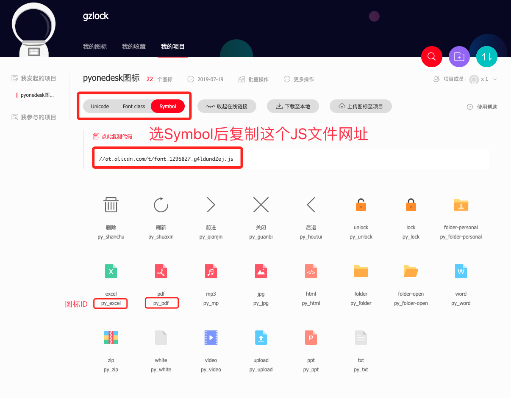

# PyOneDesk 自定义样式教程

##### 截止到编写这个文档时，所有iconfont的图标都是免费的

### 文件图标
1. 前往 [iconfont.cn](https://www.iconfont.cn/) 注册账号，新建项目
2. 挑选喜欢的图标，加入到购物车，再加入到项目
3. 选择项目的Symbol，生成js链接，填入到 图标JS网址
4. 将对应图标的ID[选填]到对应的文件图标就可以
- 勇敢尝试不用怕，操起键盘就是干，搞坏了还有还原功能😂

### 自定义样式

就是普通的css格式，需要一定的css样式基础

举例：
- 纯色背景
    - body{background: #999}
- 用网络图片当背景
    - body{background: url('https://timgsa.baidu.com/timg?image&quality=80&size=b9999_10000&sec=1563551595019&di=b37b8f06154ac4b892a42cfc7ad35b3e&imgtype=0&src=http%3A%2F%2Fb-ssl.duitang.com%2Fuploads%2Fitem%2F201305%2F26%2F20130526141956_CHGEF.jpeg')} 